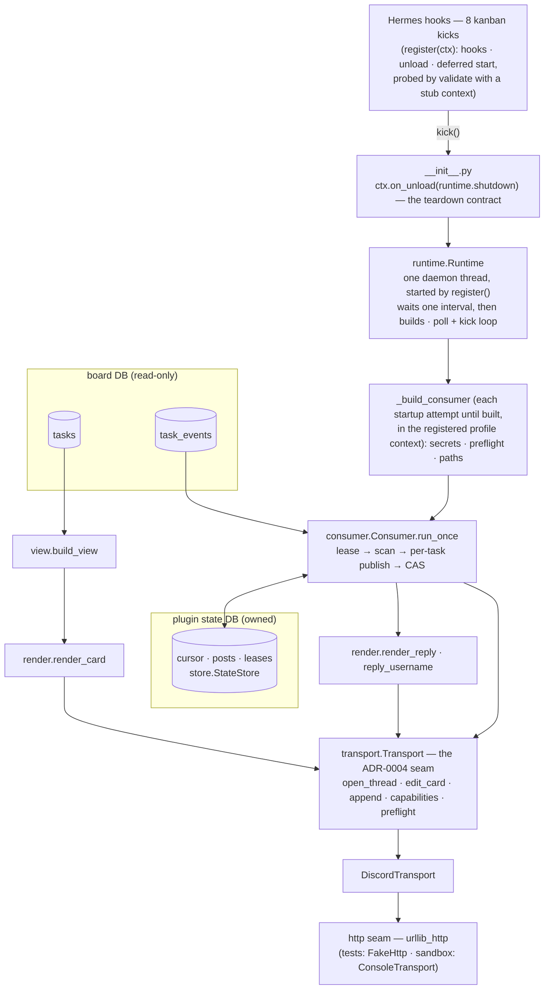
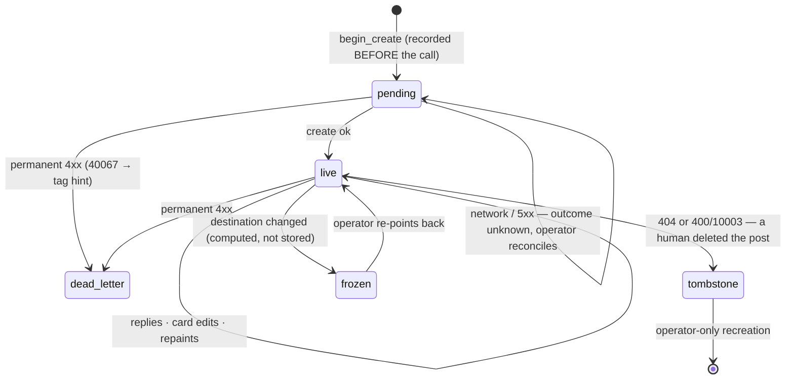

# Architecture — kanban-task-threads

How the built code maps to the decisions in [docs/adr/](docs/adr/README.md). The ADRs say *why*; this says *where*
and *how*; [docs/](docs/README.md) goes deep per topic —
[docs/mapping.md](docs/mapping.md) is the full Hermes↔Discord cross-reference
(event kinds, hooks, states, operations, error codes). Known limitations are
listed at the end — read them before trusting this document's guarantees.



The post's lifecycle in the state store — three different "stops", none of
them a deletion (terminal is not final, ADR-0005):



## Modules and their one responsibility

| Module | Responsibility | Decision |
|---|---|---|
| `__init__.py` (root) | `register(ctx)`: an explicit non-matching `publisher_profile` returns inert; otherwise registers 8 kanban hooks as kicks, the unload callback, and `runtime.start()` — no I/O of its own, since the thread sleeps before it builds. `_build_consumer` is the deferred startup: secrets, preflight, paths, degrade-to-no-op. | ADR-0002, ADR-0003, ADR-0013, ADR-0014 |
| `kanban_task_threads/runtime.py` | One daemon thread between hooks and consumer: started at register time so every profile is a lease candidate, waits one interval before its first build, poll interval as fallback for hook-less events, `shutdown()` joins the thread. | ADR-0002, ADR-0013 |
| `kanban_task_threads/view.py` | Task row → flat dict of strings. Computes `stale`; gates `workspace_path` behind opt-in. | ADR-0001, ADR-0011 |
| `kanban_task_threads/render.py` | View → `Card`; event payload → reply text. Status vocabulary, deterministic truncation, default templates. | ADR-0001, ADR-0006 |
| `kanban_task_threads/templates.py` | `format_map` over flat scalars via a Formatter that rejects `.`/`[`/positional fields; fallback to trusted defaults. | ADR-0006 |
| `kanban_task_threads/transport.py` | The seam (Protocol + capability constants), Discord writes/preflight, and bot bulk reads of active plus latest-25 archived thread metadata. `allowed_mentions: {"parse": []}` is hard-coded at the call site. | ADR-0003, ADR-0004, ADR-0007, ADR-0014 |
| `kanban_task_threads/store.py` | Durable plugin-owned state in SQLite: cursor, task→post mapping, leases, tombstones, dead letters. | ADR-0005 |
| `kanban_task_threads/consumer.py` | The loop: lease → scan `task_events` → per-task publish → cursor advance → due bounded metadata audit. Audit timing/level is private process memory; all failure policy lives here. | ADR-0007, ADR-0014 |

Everything under `kanban_task_threads/` is stdlib-only and Hermes-free: tests
import it directly, the sandbox drives it with a console transport, and the
Hermes entry point is a thin adapter on top. The Hermes imports
(`agent.secret_scope`, `hermes_cli.kanban_db`) happen only inside
`_build_consumer`, in the runtime thread, after its initial wait or sooner when
a hook kick collapses that wait.

## Startup, degradation, teardown

- **`register()` does no I/O.** `hermes plugins validate` probes it in a
  subprocess whose stub context answers *every* attribute with a no-op — the
  probe cannot be detected, so it is outlived instead: `runtime.start()` spawns
  a thread that waits a full poll interval before touching anything, and the
  probe exits in milliseconds (ADR-0013). The `callable()` guard around
  `ctx.on_unload` stays for contexts that omit it entirely.
- **`start()` makes this profile a lease candidate**, without waiting for a
  hook that may never fire here (ADR-0013). It captures
  `contextvars.copy_context()`; before each build the profile's current secret
  scope is reconstructed with the registered home pinned because ContextVars
  do not cross an unbound thread (ADR-0003). Empty dispatcher kicks cannot
  redirect the runtime to another profile; non-identity ContextVars still come
  from the latest attempt.
  Secrets: `KANBAN_TASK_THREADS_WEBHOOK_URL`
  (required; in production an `op://` reference resolved by the profile env,
  never a literal) and `KANBAN_TASK_THREADS_BOT_TOKEN` (optional, ADR-0003 extras).
  If non-empty `publisher_profile` does not exactly match `ctx.profile_name`,
  registration returns inert before any of this; empty preserves ADR-0013.
- **Startup classification**: a real config verdict (missing webhook in a
  populated scope, rejected credential, impossible tag policy, or Hermes not
  importable) logs once and exits until reload. A transient preflight or
  missing scope raises `RetryableStartup`; the thread refreshes the profile
  scope and retries each interval, sooner on a kick.
- **Preflight asymmetry**: the forum channel is asked, never configured —
  `GET` on the webhook returns its `channel_id` (ADR-0003: one credential, one
  source of truth). With a bot token the tag requirement (`flags & 16`) is
  checked at startup and fails closed with an actionable message; without one
  it is unknowable up front, so the create-time 400 (Discord code 40067) is
  mapped to the same actionable text in the dead-letter detail.
- **Teardown**: `ctx.on_unload(runtime.shutdown)`. `discover_plugins(force=True)`
  re-imports the module and `hermes plugins disable` walks the same path; an
  orphaned thread would keep contesting the lease from an unreachable module.
  Tested: after shutdown the thread is dead and the lease is immediately
  acquirable by another holder.

## The consumer model: two watermarks

ADR-0002 wants a subscription per task with a durable cursor. The live
`kanban_notify_subs` table is owned by the gateway notifier (it retries
deliveries and purges old subs), so the plugin keeps its own equivalent:

- **Per-task position** (`posts.last_event_id`) — the durable cursor that
  suppresses events already recorded as sent. It advances only after the send,
  so a crash in that interval can replay a reply.
- **Board cursor** (`cursor.last_event_id`) — only a scan low-water mark, an
  optimization. It advances by CAS to the *minimum* position any task still
  needs; a task that cannot make progress (backoff, unknown create outcome)
  holds it down, and its events are re-scanned and re-skipped cheaply until it
  can. One stuck task never blocks the others' publishing — only widens the
  scan.

Mutual exclusion across processes: a pass runs under a named lease
(`consume:<board>`, TTL 60s) acquired with `BEGIN IMMEDIATE`. The lease is
**fenced**: every acquisition returns a monotonic token (unique even for the
same holder string, so a same-pid reload is a distinguishable holder), the
consumer renews ownership *before every task's side effects* and aborts the
pass the moment renewal fails, and `set_task_position` is monotonic so a
stale writer can never rewind the deduping watermark. The residual window is
a single task whose sends outlive the TTL mid-task — bounded, and its
duplicate is a reply, never a thread. Replies are at-least-once across a
crash between send and position write; creates are stricter (below).

## Event → action mapping

Per batch and per task, in event-id order:

1. **No post yet** → `open_thread` with the current card, named
   `"{title} · {task_id}"` (the name is frozen at creation, so it carries the
   stable key; the title part is what truncation eats). Creation is decided
   by *seeing events for an unknown task* — there is no creation hook, and a
   claim must not create (ADR-0001: `claim_review_task` fires a second claim).
2. **Each event with `kind ∈ reply_on`** → one `append`, signed by the actual
   actor: the payload's named actor (`author`, `implementer`, `reviewer`) if
   any, the assignee for the worker's own actions (blocked/unblocked/
   completed), and **nobody** — the webhook's institutional name — for system
   observations (crashed, timed out, reclaimed, gave up, archived) or unknown
   actors. Default `reply_on`: `commented, blocked, unblocked, completed,
   review_requested, changes_requested, gave_up, crashed, timed_out,
   reclaimed, archived`.
3. **End of the task's batch** → one `edit_card` re-rendered from the task
   row (skipped when the post was just opened and nothing was replied).

With bot metadata capability, the first pass then audits Discord immediately.
It bulk-reads all active guild threads (filtered to the forum) and only the
latest 25 public archived forum threads. For plugin-owned posts in that set,
actual tags/archive state are repaired in safe order. Clean intervals are
5/15/30/60 minutes capped; a patch confirms after one minute. A 429 honors
`retry_after`; all audit failures are warnings and do not block the event path.

The card is signed by the webhook's own name, never a person: a webhook
message's `username` is fixed at creation and unPATCHable, and the card is
rewritten for life — the card is the board speaking, the replies are who did
what (ADR-0001, probed 2026-09-19; pinned by test).

The card never accumulates from payloads: it re-renders from `tasks` plus the
last `blocked` event's reason (the row has `block_kind` but not the reason).
The waiting line only renders while `block_kind` is present — the reason
outlives the block in the event log.

Dependency links follow ADR-0012: prerequisites roll up on the dependent's
card; prerequisites name what they unlock. Comment replies recover a bounded
excerpt conservatively from `task_comments`, falling back to author-only on
any mismatch (ADR-0011).

## Failure policy (ADR-0007), all in `consumer.py`

| Failure | Action | Store state | Log level |
|---|---|---|---|
| Create, response lost (network error **or 5xx**) | Recorded **before** the call; never blindly retried (a proxy 502 does not prove Discord created nothing); reported every pass until an operator reconciles | `posts.pending_create_at` | error |
| Create/publish, permanent 4xx | Dead-letter the task, stop publishing, keep the response as detail (40067 → "set `discord_applied_tag_ids`…") | `state='dead_letter'` | error |
| 404, or 400 with Discord code 10003, on edit/append | A human deleted the post: tombstone, stop; recreation is operator-only | `state='tombstone'` | error |
| 429 | Per-task backoff from `retry_after`; other tasks unaffected | `posts.backoff_until`, `card_dirty` | — |
| 5xx / network on reply or card edit | Retry next pass; an edit-only failure marks the card dirty so it is repainted even if the task never emits another event | `posts.card_dirty` | warning |
| Destination changed (re-pointed webhook) | Freeze the post — never replay stale ids against a webhook that cannot edit them (a 404 would read as deletion) | — (computed) | error |
| Lease lost mid-pass | Abort before the next task's side effects; the new holder continues | — | warning |

`Report.errors` (permanent) and `Report.warnings` (transient) are emitted by
the runtime through `logging.getLogger(__name__)` — the same stdlib-logger
convention Hermes's bundled plugins and plugin manager use. This is a public
plugin: where those lines are routed is the installer's decision.

## State store schema (`store.py`)

```sql
cursor (board PK, last_event_id)                  -- scan low-water mark, CAS
posts  (board, task_id PK,                        -- one row per task ever seen
        thread_id, message_id, destination,       -- ADR-0005: destination identity
        state,                                    -- live | tombstone | dead_letter
        detail, last_event_id,                    -- the deduping position
        backoff_until, pending_create_at,
        card_dirty, last_status_key,
        last_tag, last_name, thread_archived)     -- cache hints, not Discord truth
leases (name PK, holder, expires_at, token)       -- fenced consume:<board>
```

Location: `kanban_home()/kanban/plugins/kanban-task-threads/<board>.db` — the
board-shared root, never `ctx.state`/`plugin-data`, which resolve per profile
while the board is shared (ADR-0005's rationale). Rows are never deleted on
"terminal" statuses: terminal is not final (ADR-0005), and tombstones/dead letters
must survive reanimation. `posts.destination` records which webhook/forum a
post belongs to; a configured destination mismatch freezes publication rather
than treating an unreachable old post as deletion.

## Hard-won platform facts

Things a fresh reader would otherwise lose an hour to:

- **Cloudflare bans urllib's default User-Agent**: Discord answers
  `403, error code: 1010` to `Python-urllib/3.x`. `urllib_http` always sends
  an identifying UA.
- **A webhook message's `username` is fixed at creation** — a `PATCH` changes
  content but never the signature. This is *why* cards are unsigned (ADR-0001).
- **The forum post id IS the thread id** (confirmed live), and a webhook
  `PATCH` of an archived thread's starter succeeds without unarchiving it,
  while a reply unarchives. The bot audit additionally corrects archive state
  in both directions for posts inside its bounded read window (ADR-0014).
- **The supported test entry point is `./scripts/sandbox test`** — `uv`
  provisions the pinned Python and pytest environment.
- **The validate probe's stub context** returns `None` for attributes like
  `on_unload` — guard with `callable()` before invoking optional ctx surface.

## Testing layers (what proves what)

| Layer | Command | Proves |
|---|---|---|
| Unit | `./scripts/sandbox test` | rendering, truncation, template rejection, store CAS/lease/fencing, consumer failure policy, profile pinning, bulk metadata parsing/repair/backoff, runtime lifecycle, startup classification, entry-point contract |
| Runtime load | `./scripts/sandbox doctor` | `register()` loads in the real Hermes (8 hooks), offline |
| End-to-end sans Discord | `./scripts/sandbox task && ./scripts/sandbox consume` | real event rows → one post, replies in order, durable cursor |
| Live, bounded | `scripts/live_run.py` (explicit authorization each time) | the real consumer against the test forum: one pass, observe, stop. Run 2026-09-20: 1 post, 5 replies, 1 edit; second run silent. |

## Known limitations

1. **Mid-task lease overrun.** Fencing is checked before each task, not before
   each send: one task whose Discord calls outlive the TTL can still overlap
   the new holder for the duration of that task. Duplicates are bounded to
   replies/edits of a single task — a create can duplicate a *thread* only if
   the overrun happens exactly there; accepted for now.
2. **`stale` never earns a reply** — it is a render-time computation from the
   heartbeat, not a `task_events` row, so the card shows it but the log does
   not. This is intentional: the card is state, the log is events.
3. **`shutdown()` joins with a 10s timeout**: a startup/preflight or pass
   blocked longer than that can outlive the unload. Unload signals the stop
   flag before it waits, so the bound holds and no new pass starts; the
   fencing token limits overlap if an in-flight pass eventually returns (the
   successor is a different holder).
