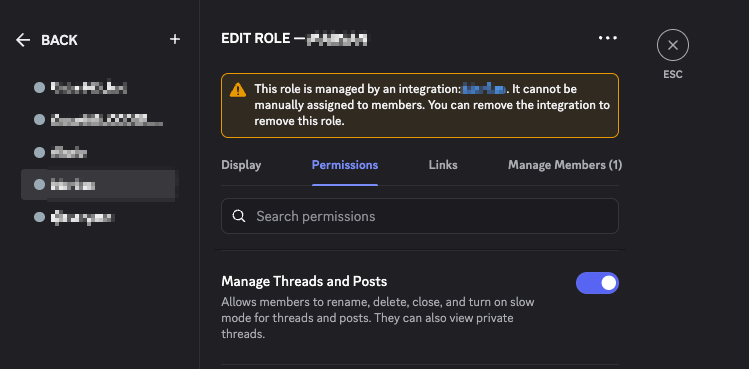

# kanban-task-threads

A Hermes plugin that gives **every kanban task a Discord forum thread of its
own**: the first post is a live status card rewritten in place, and the replies
are the append-only log. The post body answers *"what is happening now?"*; the
thread answers *"how did we get here?"*.


Webhook replies can also carry a Phosphor avatar selected by message type:


The card re-renders from board state on every change (status, block reason,
assignee, prerequisites, elapsed time via Discord's live `<t:…:R>` timestamps).
Each reply is signed with the profile that caused it. The card itself is
signed with the webhook's own name — deliberately: a webhook message's
username is fixed at creation, so signing the card with an assignee would
freeze the first one forever (see [docs/transport.md](docs/transport.md)).

## Requirements

- Hermes 0.20+ with the kanban board in use.
- A Discord **forum channel** and a **webhook** bound to it. The webhook is
  write-only and bound to one channel: a leak costs only the ability to post
  there.
- Optionally, the selected publisher profile's **existing Discord bot token**.
  Do not create a dedicated bot for this plugin. Its integration-managed role
  needs `View Channel`, `MANAGE_THREADS` (shown in Discord as **Manage Threads
  and Posts**), `READ_MESSAGE_HISTORY` for archived listing, and
  `MANAGE_CHANNELS` (**Manage Channels**) to create missing status tags. Scope
  both management permissions to this forum, not the whole server. This unlocks
  title state, tags, archiving and metadata repair. The plugin works without a
  bot token and never requires one.



Discord creates and manages this integration role for the bot. Grant the
permission to that role; it is not a role you manually assign to people.
If you do not grant `Manage Channels`, create all managed tags manually before
the first publishing pass with the documented emojis; the plugin will reuse
them and will not need that permission while the full vocabulary remains
present and unchanged.

## Install

The reviewed catalog entry is the normal install path:

```bash
hermes plugins install kanban-task-threads
hermes plugins enable kanban-task-threads   # opt-in allow-list
```

A direct GitHub install remains available for unreleased revisions, but Hermes
treats it as an unreviewed community source and scans the whole repository —
including tests, CI and documentation — before installing it:

```bash
hermes plugins install diegomarino/kanban-task-threads
hermes plugins enable kanban-task-threads
```

If a future revision reports `CAUTION`, review every finding before repeating
the command with `--force`; that flag cannot override a `DANGEROUS` verdict.
Do not disable install-time scanning. Prefer the catalog name and its reviewed,
pinned commit for normal installations.

Set the secret in your profile's environment (through your secret manager —
e.g. a 1Password `op://` reference — never a literal in config):

```
KANBAN_TASK_THREADS_WEBHOOK_URL=https://discord.com/api/webhooks/…/…
KANBAN_TASK_THREADS_BOT_TOKEN=…        # optional
```

Then restart the gateway — a gateway holds its plugin set from startup.
Confirm with `hermes plugins list` that the source column reads `user`.

The forum channel is never configured: the plugin asks the webhook where it
posts (`GET` on the webhook returns its `channel_id`). One credential, one
source of truth.

**Naming the forum** is yours to do — the plugin discovers channels, it never
creates or names them. The binding between a board and a forum is the pair
*(`board` setting, webhook secret)*, not any name. Suggested convention: name
the forum after the board's slug (`#tasks-default`, `#tasks-web`), so a human
reading the channel list can tell which board publishes where. One deployment
serves one board; point each board's deployment at its own forum's webhook.

> **Managed tags:** with a bot token, the first pass holding the board lease
> reuses or creates the exact forum tags `🔎 triage`, `📋 todo`, `📅 scheduled`,
> `🟢 ready`, `🏃 running`, `⛔ blocked`, `🙋 needs-human`, `👀 review`,
> `✅ done`, `📦 archived`, and `❌ failed`. It also repairs missing or changed
> emojis on those managed names. Existing unrelated tags are preserved.
> Discord permits at most 20 forum tags, so the pass fails closed rather than
> deleting anything if the combined set will not fit.
>
> **Forums that require tags:** the bot path automatically uses managed
> `triage` as the creation tag when no `discord_applied_tag_ids` override is
> configured, then applies the task's real state. Webhook-only installations
> must still set `discord_applied_tag_ids`, because a webhook cannot discover
> or create forum tags.

## Configuration

All optional, under `plugins.entries.<id>.settings`:

| Key | Default | Meaning |
|---|---|---|
| `board` | current board | Which board this instance serves |
| `publisher_profile` | empty | Exact `ctx.profile_name` allowed to publish. Empty preserves the public/single-profile default: every loaded profile is a lease candidate and the board lease elects the active publisher. A value pins publication and gives up cross-profile failover |
| `reply_on` | sensible set | Event kinds that earn a reply in the thread |
| `include_workspace_path` | `false` | Publish the absolute workspace path on the card (see Privacy) |
| `discord_applied_tag_ids` | `[]` | Optional creation-tag override. Required only for webhook-only operation in a forum that enforces a tag; bot mode otherwise bootstraps with managed `triage` |
| `avatar_base_url` | — | HTTPS origin of the generated static avatar bundle; blank keeps avatars off |
| `avatar_theme` | `duotone` | Global Phosphor weight: `duotone`, `fill`, or `bold` |
| `avatar_palette` | `colored` | Opinionated global palette: `colored`, `black`, or `white` |
| `poll_seconds` | `20` | Seconds between passes when no hook kicks arrive |
| `stale_after_seconds` | `600` | Heartbeat age after which a running task renders as stale |
| `dashboard_url` | — | Task page URL; may contain `{task_id}` and `{board}`. Powers the card link and each reply's trailing `[#]` (without it, `[#]` jumps to the card in-app). **Links are forever**: every URL you publish is frozen in Discord permanently, so use a stable *name* that resolves from every device you click from — never an IP (the plugin warns on literal IPs), never anything discovered at boot |
| `comment_excerpt_chars` | `180` | Comment text quoted in replies; `0` = author only |
| `card_template`, `reply_templates` | built-ins | Cosmetic templates ([docs/configuration.md](docs/configuration.md)) |

Templates are rendered through a restricted formatter (flat fields only —
attribute/index traversal is rejected) and fall back to the built-ins on any
error. What is *not* configurable, by design: which events publish, when the
card re-renders, idempotency, retry policy, truncation, and
`allowed_mentions: {"parse": []}` on every call.

### Message avatars

Avatars are author identity, not message media: the plugin sets Discord's
`avatar_url` when creating the starter or a reply. It does not add attachment
images, embed thumbnails, or image embeds. The starter always uses `default`;
replies cover `commented`, `blocked`, `unblocked`, `review_requested`,
`changes_requested`, `completed`, `gave_up`, `crashed`, `timed_out`,
`reclaimed`, and `archived`. Unknown future kinds fall back to `default`.

Discord may visually group consecutive webhook messages that have the same
username even when their `avatar_url` differs. With avatars enabled, reply
identities therefore include the type: `{profile_id} · {message_type}` (for
example, `profile_wester · blocked`). Events without an attributable actor use
`system · {message_type}`. This keeps every type's avatar visible while
preserving the real profile id whenever it fits. Discord caps webhook names at
80 characters, so an unusually long profile id is marked with `…` and shortened
just enough to retain the complete message type. When avatars are disabled,
usernames remain unchanged and system observations continue using the webhook's
own identity.

The repository includes 96 px PNGs for all three themes and palettes under
`pages/v1/`, plus their Phosphor 2.1.1 SVG sources, render manifest, and license
under `assets/avatars/`. `colored` is the approved semantic palette; `black`
uses a black glyph on a white circle and `white` uses a white glyph on a black
circle. Phosphor's native 20% duotone layer produces the secondary grey without
inventing a second icon color. Each published version also carries the Phosphor
MIT notice beside its manifest.

The checked-in workflow publishes `pages/` with GitHub's official Pages actions
when that directory changes on `main`. Enable **GitHub Actions** as the Pages
source once in repository settings, let the workflow deploy, verify a PNG, then
configure the site root:

```yaml
avatar_base_url: https://example.github.io/kanban-task-threads
avatar_theme: duotone
avatar_palette: colored
```

The local and published manifests define the path contract
`v1/{theme}/{palette}/96px/{message_type}.png`; the runtime reads the local copy
and never fetches configuration from Pages. A significant visual redesign bumps
the manifest to `v2` and keeps `v1` checked in. The renderer requires
`rsvg-convert` and performs no network access:

```bash
python3 scripts/render_avatars.py
```

Do not point `avatar_base_url` at a mutable branch or third-party icon URL. The
runtime never hotlinks Phosphor, uploads assets, probes the origin, or creates
hidden Discord messages to host files. See
[ADR-0015](docs/adr/0015-static-avatar-assets.md).

## Privacy and egress — read before enabling

Everything this plugin publishes **leaves your machine permanently** and is
visible to everyone who can read the channel:

- Task **titles**, **block reasons**, **completion summaries** and failure
  text are arbitrary agent output and may echo secrets or stack traces. They
  are published because they are the feature — length-capped, mentions
  neutralized — but they are an egress path. Point the webhook at a channel
  with an audience you trust.
- `workspace_path` contains your OS username and project layout. **Off by
  default**; opt in with `include_workspace_path`.
- Comment *text* is excerpted into replies (length-capped, ADR-0011);
  set `comment_excerpt_chars: 0` if comment bodies must never leave the board.
- When a prerequisite thread opens, its dependency announcement includes the
  first 140 characters of that task's body. This path currently has no opt-out;
  avoid sensitive task bodies when dependency announcements are enabled.

## Failure behavior

Discord being down never loses an event: the plugin consumes the board's own
event log past a durable cursor, so it resumes where it left off after any
crash or restart. Unreachable configurations degrade to a no-op with one log
line instead of queuing work that can never be sent. A deleted post is
respected (the plugin stops publishing for that task rather than re-creating
it), and re-pointing the webhook freezes old posts instead of corrupting them.
Details: [docs/failure-policy.md](docs/failure-policy.md).

Diagnostics go through the standard Python logger (`kanban-task-threads`
namespace): `warning` for transient retries, `error` for anything needing an
operator.

## Limitations, honestly

- **Comment text is excerpted, not full** — replies quote up to
  `comment_excerpt_chars` (default 180) with a link to the full text;
  set it to `0` to publish only who commented (ADR-0011).
- **Latency is seconds to `poll_seconds`**, not instant: hooks are best-effort
  kicks; correctness rides the durable cursor.
- **The thread name is frozen** for webhook-only deployments (it carries the
  task id on purpose); a bot token unlocks renames.
- **The status tag owns the thread's tags** when the bot path is active: a
  manually applied tag will not survive the next automated retag
  (docs/transport.md documents the tradeoff).
- **Metadata audit is deliberately bounded** to all active guild threads plus
  the forum's latest 25 public archived threads. Older archived posts are not
  scanned until they re-enter that window.
- **Replies are at-least-once** across a crash between send and cursor write;
  a rare duplicate reply is possible. Post creation is strictly guarded
  instead — ambiguous outcomes wait for an operator (`reconcile` verbs).
- One deployment serves **one board** and one forum. Multi-forum routing is
  deliberately not built (ADR-0010).

This project is not affiliated with or endorsed by Discord Inc. or
Nous Research.

## Uninstall

```bash
hermes plugins disable kanban-task-threads
hermes plugins remove kanban-task-threads
```

`remove` deletes the directory but does not touch `plugins.enabled` — run
`disable` too. The task→post mapping is left behind deliberately (it lives
with the board, not the plugin); posts are never deleted.

## Development

```bash
./scripts/sandbox test      # unit suite (needs uv; pytest runs only through it)
./scripts/sandbox up        # disposable Hermes home — never touches a real one
./scripts/sandbox task      # walk a task through a realistic lifecycle
./scripts/sandbox consume   # run the consumer against it, printing, no network
./scripts/sandbox doctor    # load the plugin through the real runtime, offline
```

Design rationale lives in the [ADRs](docs/adr/README.md); the map from design to code
in [ARCHITECTURE.md](ARCHITECTURE.md); topic deep-dives in [docs/](docs/); releases in
[CHANGELOG.md](CHANGELOG.md) (process: [RELEASING.md](RELEASING.md)); vulnerability
reports: [SECURITY.md](SECURITY.md).

## A second transport?

Discord is the first transport, not the only conceivable one. The transport
seam is five operations plus a capability declaration, and a Telegram mapping
exists on paper — along with what it would lose (live timestamps, per-message
identity, the webhook credential model). Read
[docs/transport.md](docs/transport.md) before proposing one.
